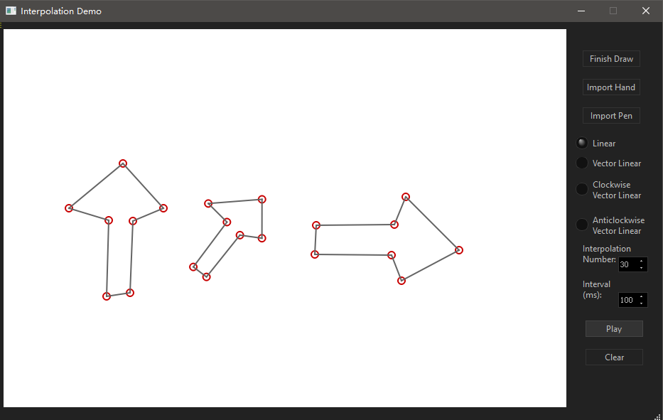
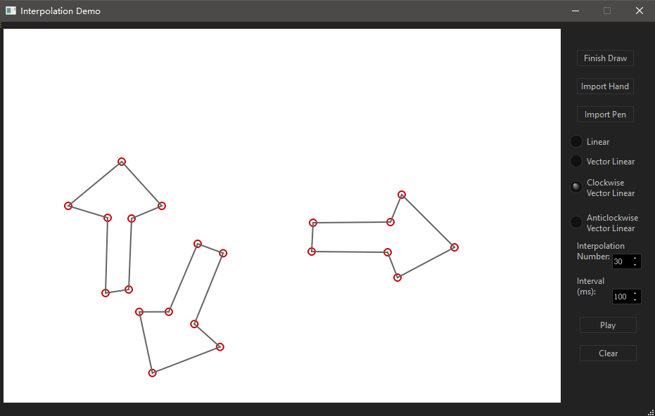
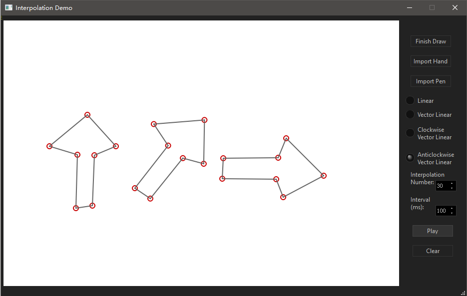

# Key-Frame-Deformation
The realization of Key Frame Deformation with Linear/ Vector Linear/ Clockwise Vector Linear/ Anticlockwise Vector Linear interpolation in "Computer Animation". Made with Qt Creator 4.6.2 in C++. 

Video: https://youtu.be/YRCe6eGgQMg

## Demo

Linear Interpolation:

Clockwise Vector Linear Interpolation:

Anticlockwise Vector Linear Interpolation:

